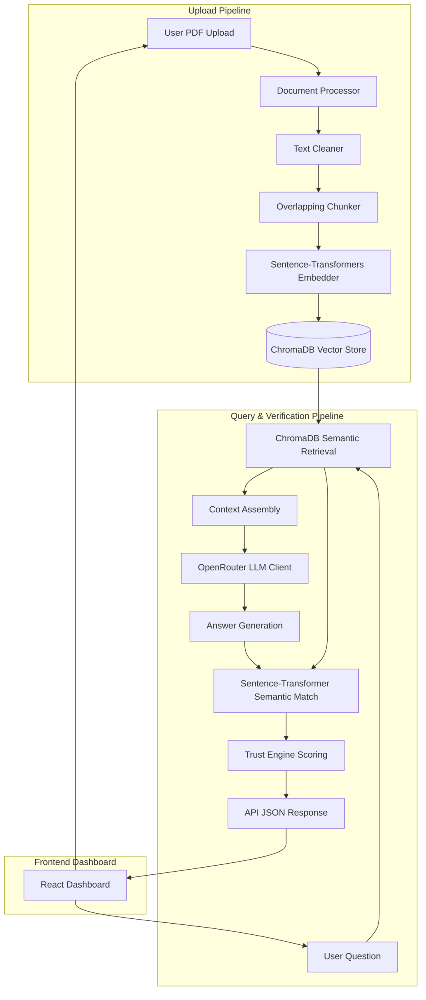

# System Architecture

This document describes the high-level architecture of **TrustLayer AI**, detailling how data flows from PDF upload to vector embedding, semantic search, context retrieval, answer generation, and real-time trust scoring.

---

## System Overview

---

## Core Components

### 1. Document ingestion Engine
- **pypdf**: Parses text from raw PDFs in a stream. Includes validation to check if documents are unreadable, empty, or scanned image-only PDFs.
- **text_cleaner.py**: Standardizes spacing, normalizes lines, and strips junk control characters.
- **chunker.py**: Breaks text into natural chunks (size 700 chars, overlap 150 chars) aligned to word boundaries.

### 2. Embeddings & Vector Store
- **embedder.py**: Loads a local instance of the `all-MiniLM-L6-v2` Sentence-Transformer model. It performs batch embedding generation on CPU.
- **vector_store.py**: Connects to a persistent ChromaDB database. Similarity metrics are configured to use **cosine space** (`hnsw:space: cosine`).

### 3. LLM Client
- **llm_client.py**: Connects via OpenAI compatible client to the **OpenRouter** API. Runs `google/gemma-3-27b-it:free` with a deterministic temperature (`0.0`). The system prompt strictly bounds the LLM to context facts and forces a specific refusal string when context is lacking.

### 4. Trust Engine
- **similarity.py**: Computes pure Python cosine similarity between generated answers and retrieved context passages.
- **trust_engine.py**: Translates similarity scores, corroborations, and retrieval parameters into a trust score, flags hallucinations, and assigns a risk level.

### 5. Frontend Dashboard
- **React + Vite**: Sleek SPA built in React with standard componentization. It fetches backend resources asynchronously using **Axios**.
